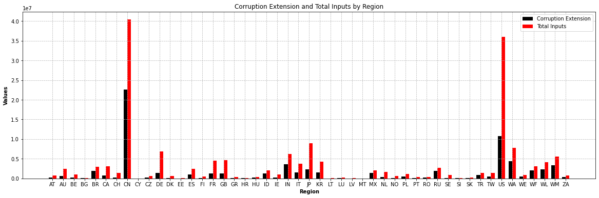
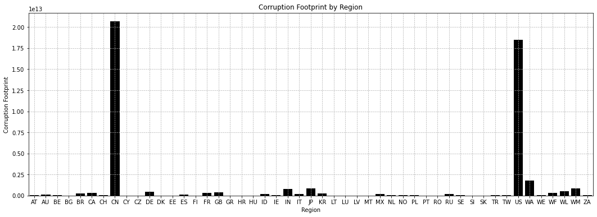
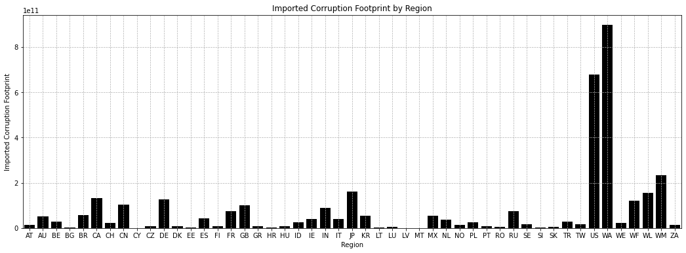
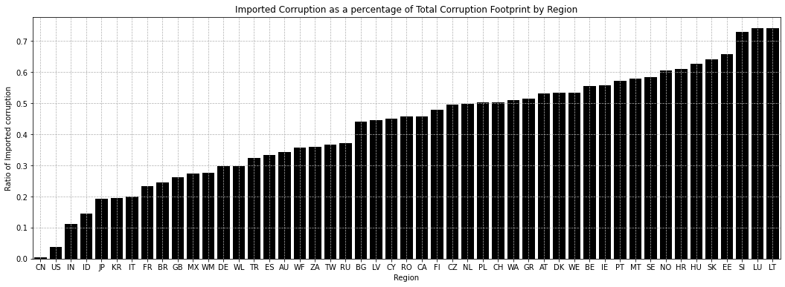

# Creating a Corruption MRIO extension
Mohamed Badr

## Introduction
MRIO extensions have been used to quantify the amount of a particular resource, both monetary and physical, going towards a given production activity. What these extensions often lack is providing a more qualitative description of production activities. At the same time the increasing abundance of index level data calls for its integration into MRIO systems. The absence of indexes providing physical or monetary units has hindered this integration. In this investigation we explore the extent by which index (corruption index) data can be used to assign attributes towards a specific products and hence consumption. To demonstrate this we conduct an exercise on the integration of corruption index data produced by Transparency international, in the form of an EXIOBASE extension which can then be used to describe the units of corruption involved in producing a given product or service. We find that by multiplying the sum of the total monetary inputs (including value added) by a index coefficient, attained by slightly modifying the index score based on the sector, we are able to better quantify the inputs directed towards a certain production. We also present some results on the corruption footprints of several regions as a demonstration of how index data can be reshaped into an MRIO extension. The research argues that index data, when properly treated, can and should be used in MRIO extensions to attain more qualitative insight. 

## Data 

For this exercise we use a product by product system of EXIOBASE 3.8.2 for the year 2022. The corruption data is provided by Transparency International's Corruption Perception Index (CPI) for the year 2023.  

## Method
The methodology used in this exercise is done by combining MRIO calculations with the CPI index. The CPI index provides a corruption perception score for each region. These estimates are assigned to each EXIOBASE 3.8.2 region and aggregates for the rest of the world regions are formed. The sectors are then assigned sector specific scores and from there an extension is formed. This extension provides an approximation of the amount of corruption present in a given sector. More on the assumptions can be found in the article.

## Results 
The results display how index data, when properly treated, can be transformed into MRIO extension data. 

### An MRIO corruption extension
With the corruption extension data we present an overview of the corruption extension which is calculated as a fraction of th total inputs. 

### Footprint Calculations 
Total consumption based corruption footprints per region are displayed bellow. This answers the question of which final demand vectors are the most demanding in regards to corrupt products/sectors. 

Total Imported accounts with regards to corrupt consumption are displayed bellow.

Ratio of imported accounts to total corruption footprint is displayed bellow;
